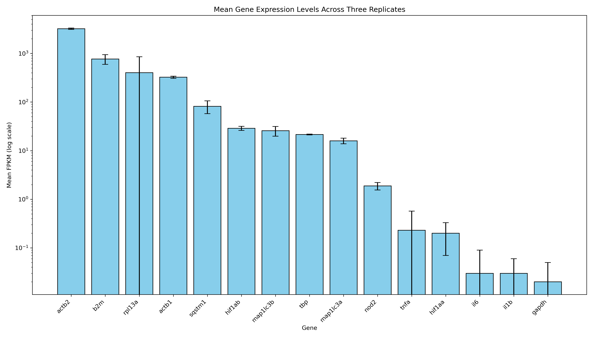
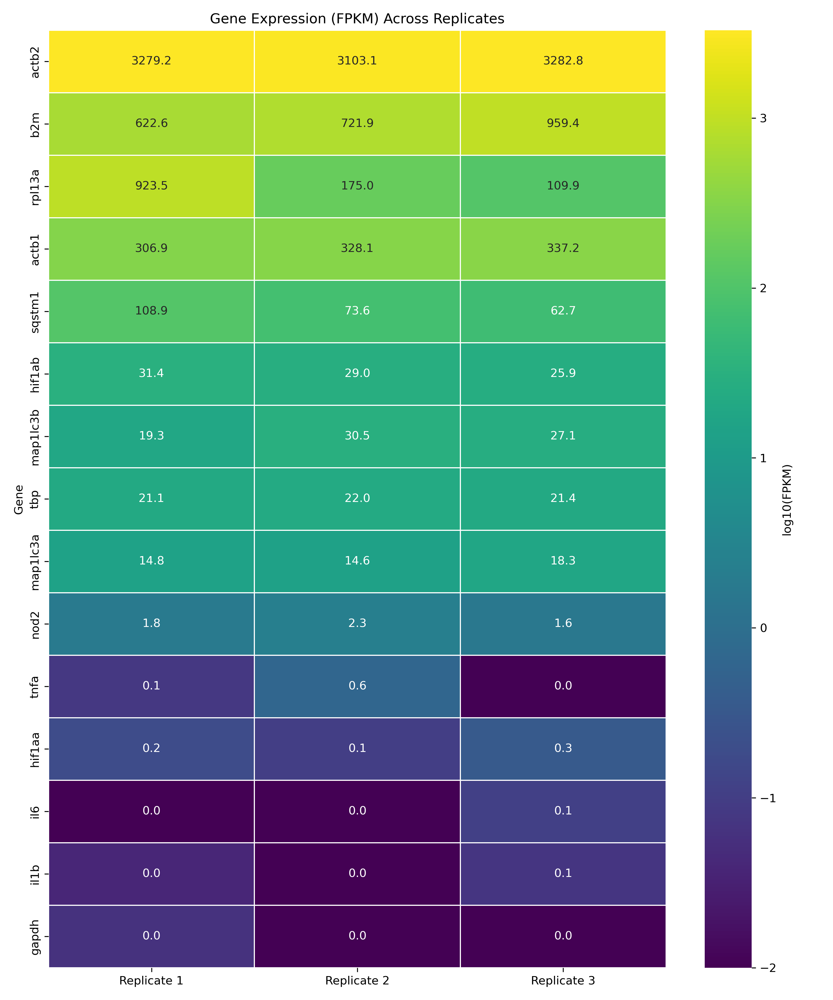

# NOD2 Expression Analysis in Zebrafish RNA-seq Replicates

<head>
<style>
.code-container {
  position: relative;
  margin-bottom: 1em;
}
.code-block {
  background-color: #f5f5f5;
  border-radius: 4px;
  padding: 1em;
  overflow-x: auto;
  margin: 0;
}
.copy-button {
  position: absolute;
  top: 5px;
  right: 5px;
  padding: 4px 8px;
  background-color: #f1f1f1;
  border: 1px solid #ccc;
  border-radius: 4px;
  font-size: 12px;
  cursor: pointer;
  opacity: 0.7;
  transition: opacity 0.3s;
}
.copy-button:hover {
  opacity: 1;
}
.copy-success {
  color: green;
}
</style>
<script>
document.addEventListener('DOMContentLoaded', function() {
  const codeBlocks = document.querySelectorAll('pre code');
  
  codeBlocks.forEach((codeBlock, index) => {
    const container = document.createElement('div');
    container.className = 'code-container';
    const parent = codeBlock.parentNode;
    parent.parentNode.insertBefore(container, parent);
    container.appendChild(parent);
    
    const copyButton = document.createElement('button');
    copyButton.className = 'copy-button';
    copyButton.textContent = 'Copy';
    copyButton.addEventListener('click', function() {
      const textToCopy = codeBlock.textContent;
      navigator.clipboard.writeText(textToCopy)
        .then(() => {
          copyButton.textContent = 'Copied!';
          copyButton.classList.add('copy-success');
          setTimeout(() => {
            copyButton.textContent = 'Copy';
            copyButton.classList.remove('copy-success');
          }, 2000);
        })
        .catch(err => {
          console.error('Failed to copy text: ', err);
        });
    });
    
    container.appendChild(copyButton);
  });
});
</script>
</head>

**Author:** Noah Nicol  
**Date:** March 2025

## Overview

This document outlines the RNA-seq analysis process for three zebrafish normoxia samples (SRR19627923, SRR19627924, SRR19627925). The analysis includes data acquisition, quality control, alignment, expression quantification, and visualization, with a specific focus on NOD2 and housekeeping genes for comparison.

The analysis extracts raw gene counts from featureCounts output files, calculates FPKM (Fragments Per Kilobase Million) values, and compares expression levels across the RNA-seq replicates.

## Required Software and Packages

### Terminal Tools
1. **SRA Toolkit**: For downloading FASTQ files
   - `conda install -c bioconda sra-tools`
2. **FastQC**: For quality control
   - `conda install -c bioconda fastqc`
3. **Trimmomatic**: For trimming low-quality reads
   - `conda install -c bioconda trimmomatic`
4. **HISAT2**: For aligning reads to the genome
   - `conda install -c bioconda hisat2`
5. **Samtools**: For SAM/BAM file processing
   - `conda install -c bioconda samtools`
6. **Subread (featureCounts)**: For expression quantification
   - `conda install -c bioconda subread`

### Python Packages
Install using pip or conda:

```bash
pip install matplotlib seaborn pandas numpy jupyter
```

## RNA-seq Analysis Workflow
- Shown for SRR19627925 only for illustration

### 1. Data Acquisition

- Download paired-end RNA-seq data using SRA Toolkit:

```bash
prefetch SRR19627925
fasterq-dump SRR19627925
```

- Perform quality control using FastQC:

```bash
fastqc SRR19627925_1.fastq SRR19627925_2.fastq
```

Note: Because these samples are standard bulk RNA reads, I did no deduplication (generally used to reduce PCR amplification bias). The applicable warnings were 'Per base sequence content' (which looked like what I would expect) and 'Adapter Content' (which I tried to adjust, but was challenged in finding the specific sequence corresponding to the *Illumina Universal Adapter*).


- Trim reads using Trimmomatic:

```bash
trimmomatic PE SRR19627925_1.fastq SRR19627925_2.fastq \
  SRR19627925_1_paired_trimmed.fastq SRR19627925_1_unpaired_trimmed.fastq \
  SRR19627925_2_paired_trimmed.fastq SRR19627925_2_unpaired_trimmed.fastq \
  AVGQUAL:20 TRAILING:20 MINLEN:50
```

### 2. Genome Alignment

- Download and index zebrafish genome (GRCz11/GCF_000002035.6):

```bash
wget https://ftp.ncbi.nlm.nih.gov/genomes/all/GCF/000/002/035/GCF_000002035.6_GRCz11/GCF_000002035.6_GRCz11_genomic.fna.gz
gunzip GCF_000002035.6_GRCz11_genomic.fna.gz
hisat2-build GCF_000002035.6_GRCz11_genomic.fna zebrafish_index
```

- Align reads using HISAT2:

```bash
hisat2 -x zebrafish_index \
  -1 SRR19627925_1_paired_trimmed.fastq \
  -2 SRR19627925_2_paired_trimmed.fastq \
  -S SRR19627925.sam \
  --summary-file SRR19627925_alignment_summary.txt
```

- The alignment_summary.txt file above will show alignment rates. In sample 1, I achieved ~77% overall alignment rate:
  - ~58% aligned concordantly exactly once
  - ~12% aligned concordantly multiple times
  - ~30% failed to align concordantly

### 3. Post-alignment Processing

- Convert SAM to BAM format using samtools:

```bash
samtools view -bS SRR19627925.sam -o SRR19627925.bam
samtools sort SRR19627925.bam -o SRR19627925_sorted.bam
samtools index SRR19627925_sorted.bam
```

### 4. Expression Quantification

- Use featureCounts for gene-level quantification:

```bash
featureCounts -p -t exon -g gene_id \
  -a genomic.gtf -o gene_counts.txt SRR19627925_sorted.bam
```

## Analysis Scripts

After generating the gene count files for each replicate, I created custom scripts to extract and analyze the expression data:

1. **`get_gene_counts.py`**: Extracts specific raw gene counts from the featureCounts output files

```bash
python get_gene_counts.py
```

2. **`calculate_fpkm.py`**: Calculates FPKM values from gene counts and creates comparison tables with visualizations

```bash
python calculate_fpkm.py
```

3. **`NOD2_expression.ipynb`**: Jupyter notebook for exploring and visualizing the results

```bash
jupyter notebook NOD2_expression.ipynb
```

## Genes Analyzed

The analysis focused on the following genes:

1. **Housekeeping genes**: 
   - actb1, actb2 (β-actin)
   - b2m (β-2-microglobulin)
   - tbp (TATA-box binding protein)
   - gapdh (glyceraldehyde 3-phosphate dehydrogenase)
   - rpl13a (ribosomal protein L13a)
   - map1lc3a, map1lc3b (LC3A/B - autophagy markers)
   - sqstm1 (p62 - autophagy marker)
   - hif1aa, hif1ab (hypoxia-inducible factor 1α paralogs)
   - il1b (interleukin 1β)
   - tnfa (tumor necrosis factor α)
   - il6 (interleukin 6)

2. **Target gene**:
   - nod2 (nucleotide-binding oligomerization domain 2)

## FPKM Calculation Method

FPKM (Fragments Per Kilobase Million) values were calculated using the standard formula:

```python
# Example FPKM calculation for NOD2
NOD2reads = 220
length_bases = 4561  
length_kb = length_bases / 1000  # Convert to kilobases
total_reads = 29743387

# FPKM formula
fpkm = (NOD2reads * 1e9) / (length_kb * total_mapped)
```

## Expression Level Categories

The genes were categorized based on their FPKM values:
- **Very High**: FPKM > 100
- **High**: 10 < FPKM ≤ 100
- **Moderate**: 1 < FPKM ≤ 10
- **Low**: FPKM ≤ 1

## Results and Analysis

### Key Findings

1. **NOD2 Expression:**
   - NOD2 is expressed at a moderate level (Mean FPKM: ~1.9)
   - Expression is consistent across all three replicates
   - This confirms that NOD2 is expressed in zebrafish under normoxic conditions

2. **Gene Expression Patterns:**
   - Housekeeping genes show the highest expression levels (as expected)
   - Autophagy markers (map1lc3a, map1lc3b, sqstm1) show high expression
   - Inflammatory genes (il1b, tnfa, il6) show low expression under normal conditions
     - Low expression of inflammatory genes is expected in normoxia [1]
   - HIF1α paralogs show differential expression (hif1ab > hif1aa)

3. **Replicate Consistency:**
   - Most genes show consistent expression across replicates
   - Some genes (e.g., rpl13a) show higher variability between replicates

### Expression Summary Table

| Gene     | Mean FPKM | Expression Level |
|----------|-----------|-----------------|
| actb2    | 3221.67   | Very High       |
| b2m      | 767.95    | Very High       |
| actb1    | 324.06    | Very High       |
| rpl13a   | 402.77    | Very High       |
| sqstm1   | 81.74     | High            |
| hif1ab   | 28.79     | High            |
| map1lc3b | 25.64     | High            |
| tbp      | 21.50     | High            |
| map1lc3a | 15.93     | High            |
| nod2     | 1.88      | Moderate        |
| tnfa     | 0.23      | Low             |
| hif1aa   | 0.20      | Low             |
| il6      | 0.03      | Low             |
| il1b     | 0.03      | Low             |
| gapdh    | 0.02      | Low             |

### Data Visualization

The analysis included several visualizations:
- Bar plots of FPKM values across genes
- Heatmap showing expression patterns across replicates
- Coefficient of variation analysis for replicate consistency




## Conclusion

This analysis provides a comprehensive analysis of NOD2 expression in zebrafish under normoxic conditions. The moderate expression level of NOD2 (FPKM ~1.9) suggests that it plays a functional role in the ZFL line under atmospheric conditions.

The expression patterns observed align with expectations: housekeeping genes are highly expressed, inflammatory genes show low expression in normoxia, and autophagy markers show basal expression.


## References

[1] Eltzschig HK, Carmeliet P. Hypoxia and inflammation. N Engl J Med. 2011 Feb 17;364(7):656-65. doi: 10.1056/NEJMra0910283. PMID: 21323543; PMCID: PMC3930928. 